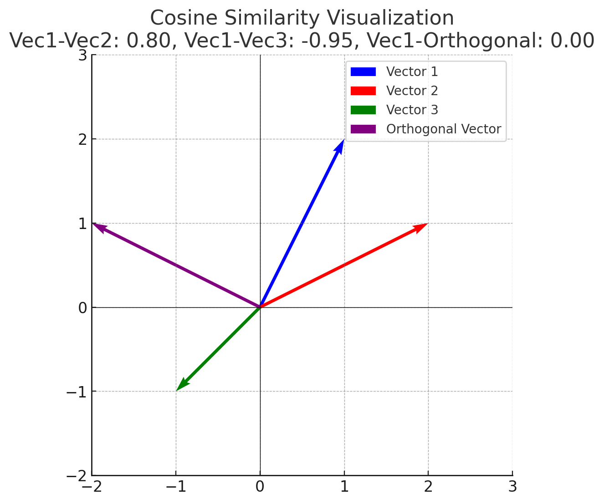

# Zero-Shot Image Classification with CLIP

## Overview

[CLIP](https://arxiv.org/abs/2103.00020) (Contrastive Language-Image Pretraining) enables zero-shot image classification by associating images with text descriptions. Here's how it works:

1. **Pre-trained Model**: CLIP is trained on a large dataset of image-text pairs.
2. **Text Prompts**: For classification, text descriptions of classes (e.g., "a photo of a cat," "a photo of a dog") are used as prompts.
3. **Feature Encoding**: Both image and text prompts are encoded into a shared feature space using the model.
4. **Similarity Scoring**: The similarity between image features and each text prompt is calculated.
5. **Prediction**: The class with the highest similarity score is assigned to the image.

This approach allows CLIP to classify images without task-specific training.


image source: [OpenAI](https://openai.com/research)

---

## Installation

To get started, install the required libraries:

```bash
conda create --name myenv python=3.9 -y
conda activate myenv
conda install --yes -c pytorch pytorch=1.7.1 torchvision cudatoolkit=11.0
pip install ftfy regex tqdm
pip install git+https://github.com/openai/CLIP.git
conda install conda-forge::matplotlib -y
pip install numpy
conda install conda-forge::opencv -y
```

Clone the repository:

```bash
git clone https://github.com/MjdMahasneh/zero-shot-CLIP-based-image-classification.git
cd zero-shot-image-classification-clip
```

## Usage
**Run one of the following examples:**  
- `python zero_shot_vision_language_cls.py`: This script classifies images using CLIP's zero-shot capabilities.
- `python Image_search_based_on_text_description.py`: This script searches for images based on text descriptions using CLIP's zero-shot capabilities.
If dependencies are installed and the image path is correct, the script will classify the image using CLIP's zero-shot capabilities.

---

## Technical details of the main steps 

## Preprocess

**Code:**

`image = preprocess(Image.open("./data/image_1.jpg")).unsqueeze(0).to(device)`

- **Intuition:** Converts the input image into a format that the model understands (e.g., resizing, normalizing pixel values, and converting to tensors).
- **Technically:** Resizes the image to `224x224`, normalizes pixel values, and converts it into a PyTorch tensor.

---

## Normalize

**Code:**  
`image_features /= image_features.norm(dim=-1, keepdim=True)`  
`text_features /= text_features.norm(dim=-1, keepdim=True)`

- **Intuition:** Ensures image and text feature vectors are on the same scale, avoiding biases toward larger or smaller vectors.
- **Technically:** Divides each vector by its L2 norm to ensure unit length.


---

## Similarity Calculation

The cosine similarity is the cosine of the angle between these two vectors. Values close to 1 indicate that the vectors are closely aligned, while values near 0 indicate they are orthogonal. Negative values suggest they point in opposite directions.
- **Intuition:** Measures how "close" image features are to text features to find the most relevant class.
- **Technically:** Uses cosine similarity, which calculates the cosine of the angle between two vectors. Higher values indicate greater similarity.

**Formula:**  
Cosine similarity is defined as:


`cosine similarity = (A ⋅ B) / (||A|| ||B||)`

**Where:**
- A and B are vectors.
- **⋅** represents the dot product.
- ||A|| and ||B|| represent the magnitudes (L2 norms) of the vectors.


To better understand the cosine similarity, let's visualise it:

**Run the Script:**  
`python cosine_similarity.py`



The plot above shows four vectors in 2D space, with their cosine similarity calculated based on the angle between them:

- **Vector 1 (Blue):** The reference vector.
- **Vector 2 (Red):** Closer to Vector 1, with a cosine similarity of 0.89, indicating a small angle between them.
- **Vector 3 (Green):** Points in the opposite general direction to Vector 1, with a cosine similarity of -0.71, indicating they are more dissimilar (i.e., larger angle).
- **Orthogonal Vector (Purple):** Perpendicular to Vector 1, with a cosine similarity of approximately 0.00, confirming orthogonality.

---
**Reference:**
- [Learning Transferable Visual Models From Natural Language Supervision](https://arxiv.org/abs/2103.00020)
- CLIP official [GitHub](https://github.com/openai/CLIP) repository.
